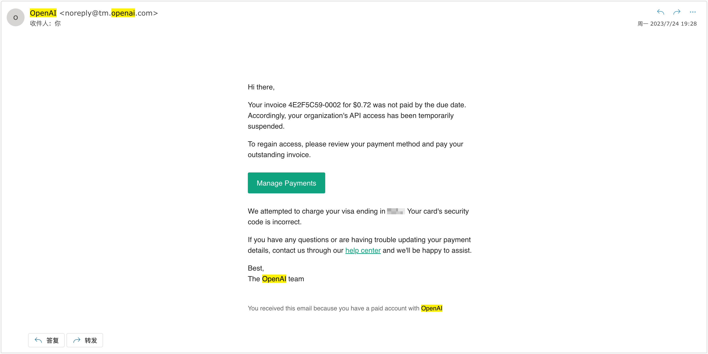
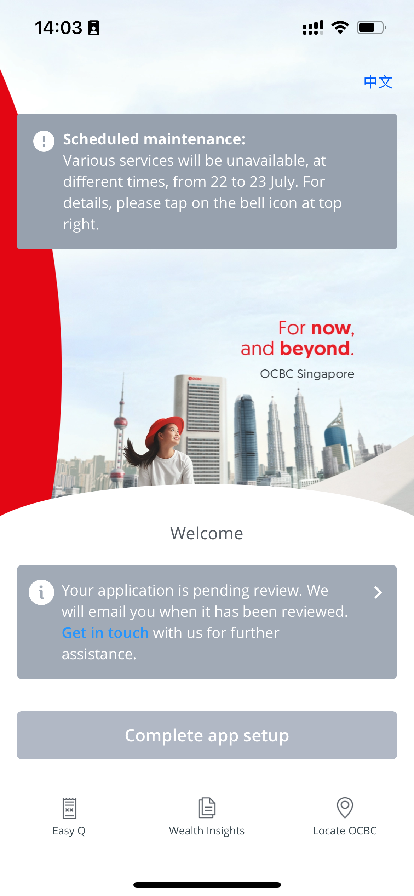

# best-openai-payment

目前国内唯一可用的 openai 支付方式

在 depay、nobepay 都被 OpenAI 封杀后，最近终于折腾出一套新的方案，全程无需翻墙，一切手段合理合法 👇

> 附7月 24 日支付成功截图

## 环境要求

- 中国大陆身份
- 有效护照，对签证无要求
- 电脑，用于边看教程边操作
- 支持 NFC功能的手机，安卓苹果皆可，推荐用苹果
- 无需翻墙

## 第一步-注册

1. app store下载并安装“ocbc digital”

2. 发现只有登录，没有“注册”功能，这时关闭 app

3. 打开设置->OCBC DIGITAL->首选语言 改成英文

4. 打开 app，进入启动页面，具体等待时间受ocbc 服务器影响，最长试过半分钟左右

5. 出现语言选择页面，建议选择英文

6. 依次选择注册账号->用e-passport登录，进入注册页面

7. 给予软件各种权限后，填写推荐码 JWA9FDOS，成功激活账号后你我都可以获得 15 新元的奖励

8. 如实填写各种资料、识别护照信息即可，工作类型请不要填写自雇，会增加审核的等待时间

9. 账号注册成功后，等待银行审核，审核通过后会收到短信、邮件通知

## 第二步-激活

向你的 OCBC 账号汇入 1000 新元，目标是激活账号，领取新人奖励，并申请虚拟借记卡。
通过大陆、香港银行汇入都可，下面以招行为例

1. 打开“招商银行”APP，搜索“外汇购汇”

2. 购入 1000 新元

3. 搜索“境外汇款”

4. 填入 ocbc app 中的各种收款信息，手续费选择自己承担（25 美金）

5. 等待银行审核
6. 审核通过后银行会发短信通知你，这时候等待汇款到账即可

## 第三步-申请虚拟借记卡
1. 点击 OCBC DIGITAL左上角的菜单栏，选择“申请”

2. 选择“账户”

3. 选择360账户，按要求填写资料

4. 填写完成后，虚拟借记卡马上很快就批下来，注意查收邮箱、短信
5. 注意保存好自己的卡号、到期日、CVV，一旦丢失后果严重，也无法重新取回，只能挂失、补办

## 第四步-激活虚拟借记卡
1. 点击 OCBC DIGITAL左上角的菜单栏，选择“银行卡服务”

2. 选择“激活信用卡/借记卡”

3. 选择你的借记卡进行激活后，即可在 OpenAI 上支付账单，泪目😭
